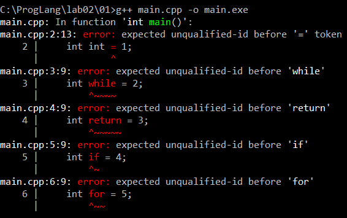
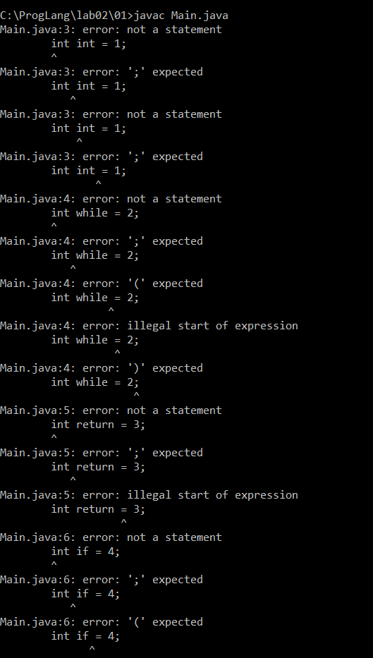
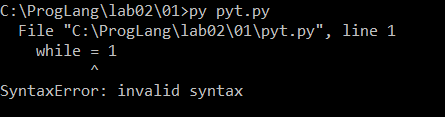
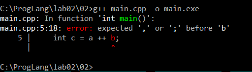
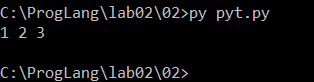
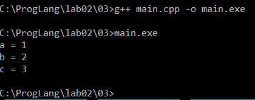
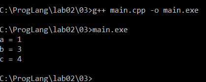
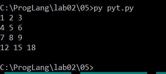
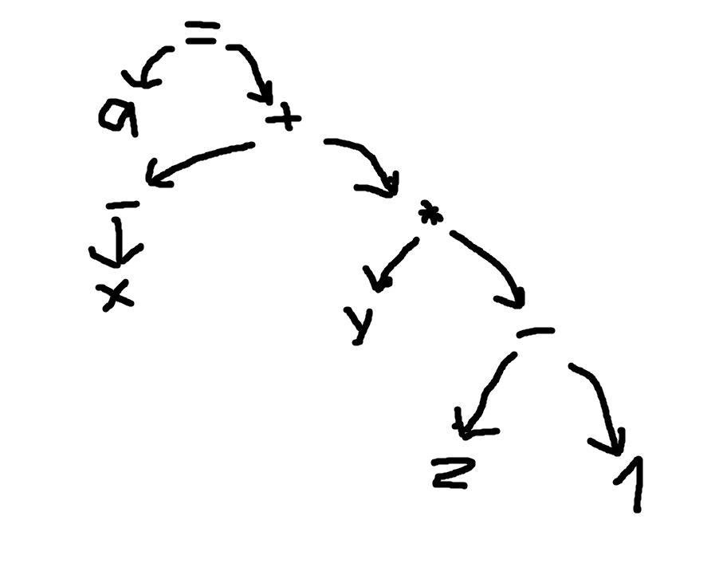

# Лабораторная работа 2

## Решение задач из практикума Python

## 01

```python
name1 = str(input())
name2 = str(input())
print(name1 + " and " + name2 + " was here")
```

## 02

```python
a, b, c = str(input()).split()
d, e = str(input()).split()
print(a, d, b, e, c, sep=',')
```

## 03

```python
a, b = str(input()).split()
c, d = str(input()).split()
e, f = str(input()).split()
print(len(a) * int(b) + len(c) * int(d) + len(e) * int(f))
```

## 04

```python
a = str(input())
print('*' * (len(a) + 4))
print('* ' + a + ' *')
print('*' * (len(a) + 4))
```

## 05

```python
a, b, c = map(int, input().split())
d, e, f = map(int, input().split())
print(d * 3600 + e * 60 + f - a * 3600 - b * 60 - c)
```

## 06

```python
n = int(input())

if n == 1:
    print("pusk")
else:
    print(n - 1)
```

## 07

```python
a, b, c = map(int, input().split())

if a == 3 and b == 3 and c == 3:
    print("hole")
else:
    print(a + b + c)
```

## 08

```python
a, b, c = str(input()).split()

if len(a) > len(b) and len(a) > len(c):
    print(a)
elif len(b) > len(a) and len(b) > len(c):
    print(b)
else:
    print(c)
```

## 09

```python
a, b = map(int, input().split())

if a > b:
    print('>')
elif a < b:
    print('<')
else:
    print('=')
```

## 10

```python
a, b, c = map(int, input().split())

if a > b:
    a, b = b, a

if c < a:
    print(a - c)
elif c > b:
    print(c - b)
else:
    print(0)
```

## 11

```python
x = int(input())

while x != 1:
    if x % 2 != 0:
        print(x, end=' ')
        x = x * 3 + 1
    else:
        print(x, end=' ')
        x = x // 2

print(1)
```

## 12

```python
n = int(input())
k = 1

while n >= 2 * k:
    k = k * 2

print(k)
```

## 13

```python
name = input()
n = 1

while name != "Petr":
    n += 1
    name = input()

print(n)
```

## 14

```python
n, a = map(int, input().split())

while n > 0:
    if a % 2 != 0 and a % 3 != 0 and a % 5 != 0 and a % 7 != 0:
        print(a)
        n -= 1
        a += 1
    else:
        a += 1
```

## 15

```python
a, b = input().split()

digits = {
    '0': 0,
    '1': 1,
    '2': 2,
    '3': 3,
    '4': 4,
    '5': 5,
    '6': 6,
    '7': 7,
    '8': 8,
    '9': 9
}

number_a = 0

for digit in a:
    number_a = number_a * 10 + digits[digit]

number_b = 0

for digit in b:
    number_b = number_b * 10 + digits[digit]

while number_b != 0:
    number_a, number_b = number_b, number_a % number_b

print(number_a)
```

## Задания лабораторной работы

## 01

Были выбраны следующие ключевые слова:

- C++: `for`, `while`, `return`, `if`, `int`;
- Java: `for`, `while`, `return`, `if`, `int`;
- Python: `if`, `return`, `while`, `for` `class`.

Ключевое слово имеет закрепленное синтаксическое значение, поэтому его нельзя использовать как обычный идентификатор переменной.

**Проверка C++:**



**Проверка Java:**



**Проверка Python:**



## 02

### C++

Последовательность токенов:

`int | a | = | 1 | , | b | = | 2 | ;`

`int | c | = | a | ++ | b | ;`

В C++ последовательность `++` распознаётся токенизатором как единый оператор инкремента. 
Поэтому после выражения `a++` непосредственно расположен идентификатор `b`, между ними отсутствует бинарный оператор. Программа синтаксически некорректна.



### Python

Последовательность токенов:

`a | = | 1`

`b | = | 2`

`c | = | a | + | + | b`

В Python оператора `++` нет. Два символа `+` распознаются отдельно: первый является бинарным сложением, второй — унарным плюсом.

Поэтому выражение эквивалентно:

`c = a + (+b)`

При `a = 1`, `b = 2` получаем `c = 3`.



## 03

### Разбиение на токены

Выражение

```cpp
a +++ b
```

разбивается на следующие токены:

```text
a | ++ | + | b
```

Последовательность `++` распознаётся как единый токен — оператор постфиксного инкремента. Поэтому выражение интерпретируется как:

```cpp
(a++) + b
```

При начальных значениях:

```text
a = 1
b = 2
```

для вычисления выражения используется исходное значение `a`, после чего `a` увеличивается на единицу:

```text
c = 1 + 2 = 3
a = 2
b = 2
```

**Результат выполнения:**



### Влияние пробелов

Если изменить выражение на:

```cpp
a + ++b
```

оно будет разбито иначе:

```text
a | + | ++ | b
```

В данном случае `++` применяется уже к переменной `b`.

Таким образом, расположение пробелов между символами операторов может изменить результат токенизации и, следовательно, смысл выражения.

**Результат после изменения расположения пробелов:**



## 04

Рассмотрено использование круглых `()` и квадратных `[]` скобок в языке C++.

### Круглые скобки как оператор

Круглые скобки являются оператором при вызове функции.

Например:

```cpp
abs(x);
```

В данном случае `()` обозначает вызов функции `abs`, а `x` является её аргументом.

Другой пример:

```cpp
func(a, b);
```

Здесь выполняется вызов функции `func` с аргументами `a` и `b`.

### Круглые скобки не как оператор

Круглые скобки также могут использоваться для группировки частей выражения:

```cpp
a = (b + c) * d;
```

В данном случае скобки изменяют порядок вычисления выражения и не являются оператором вызова функции.

Также круглые скобки используются как часть синтаксических конструкций языка:

```cpp
if (a > b) {
    // ...
}
```

Здесь скобки являются частью конструкции условного оператора.

### Квадратные скобки

Квадратные скобки являются оператором индексирования.

Например:

```cpp
a[i]
```

Оператор `[]` используется для обращения к элементу массива или другого объекта, поддерживающего индексирование.

## 05

**Ключевые слова:**

```text
for
in
```

**Идентификаторы:**

```text
print
map
sum
zip
int
input
split
i
```

**Переменная:**

```text
i
```

**Литералы:**

```text
1
2
3
```

### Разбор функций

`input()` получает одну строку со стандартного ввода.

`split()` разбивает введённую строку на отдельные элементы по пробельным символам.

Конструкция:

```python
map(int, input().split())
```

применяет функцию `int` к каждому полученному элементу, преобразуя строки в целые числа.

Конструкция:

```python
[map(int, input().split()) for i in (1, 2, 3)]
```

выполняет ввод три раза и создаёт три последовательности чисел.

Оператор `*` перед полученной последовательностью выполняет распаковку аргументов при передаче их в функцию `zip`.

Функция:

```python
zip(...)
```

объединяет элементы последовательностей с одинаковыми позициями.

После этого:

```python
map(sum, ...)
```

применяет функцию `sum` к каждой сформированной последовательности.

Последний оператор `*` распаковывает полученные суммы и передаёт их функции `print`.



## 06

В языке C++ используются однострочные и блочные комментарии.

### Однострочный комментарий

Однострочный комментарий начинается с:

```cpp
//
```

Например:

```cpp
int a = 10; // значение переменной a
```

Весь текст после `//` до конца строки рассматривается как комментарий и не участвует в дальнейшем анализе программы.

### Блочный комментарий

Блочный комментарий располагается между символами:

```cpp
/*
```

и:

```cpp
*/
```

Например:

```cpp
/*
    Это блочный
    комментарий
*/
int a = 10;
```

Содержимое комментария не рассматривается как часть программы.
Обычные блочные комментарии C++ не поддерживают вложенность.

Например:

```cpp
/*
    Первый комментарий
    /* Второй комментарий */
*/
```

Первое встретившееся сочетание `*/` завершает блочный комментарий. Оставшаяся часть исходного текста снова анализируется как программный код, что может привести к синтаксической ошибке.

Таким образом, при анализе комментариев необходимо учитывать не только последовательности `//`, `/*` и `*/`, но и контекст, в котором они находятся.

## 07 

В стандарте C++ для `iteration-statement` приведены следующие правила:

```text
iteration-statement:
    while ( condition ) statement
    do statement while ( expression ) ;
    for ( init-statement conditionopt ; expressionopt ) statement
    for ( for-range-declaration : for-range-initializer ) statement
```

Как видно из правил, существует **четыре вида инструкций циклов**.

### 1. Цикл `while`

Правило:

```text
while ( condition ) statement
```

Формат записи: ключевое слово `while`, далее в круглых скобках записывается условие `condition`, после которого располагается выполняемая инструкция `statement`.

Условие проверяется перед каждой итерацией. Пока оно истинно, выполняется тело цикла.

Пример:

```cpp
int x = 1;

while (x < 1000) {
    cout << x;
    x *= 2;
}
```

В данном примере цикл выполняется, пока значение `x` меньше `1000`.

### 2. Цикл `do-while`

Правило:

```text
do statement while ( expression ) ;
```

Формат записи: ключевое слово `do`, далее выполняемая инструкция `statement`, после неё ключевое слово `while`, в круглых скобках выражение `expression` и символ `;`.

Условие проверяется после выполнения тела цикла. Поэтому тело `do-while` выполняется как минимум один раз.

Пример:

```cpp
int x = 1;

do {
    cout << x;
    x *= 2;
} while (x < 1000);
```

### 3. Цикл `for`

Правило:

```text
for ( init-statement conditionopt ; expressionopt ) statement
```

Формат записи: ключевое слово `for`, далее в круглых скобках располагаются начальная инструкция `init-statement`, необязательное условие `condition` и необязательное выражение `expression`. 
После круглых скобок находится тело цикла `statement`.

Пример:

```cpp
for (int i = 0; i < 10; i++) {
    cout << i;
}
```

Здесь:

```text
int i = 0  — начальная инструкция
i < 10     — условие продолжения цикла
i++        — выражение, выполняемое после каждой итерации
```

### 4. Цикл `range-based for`

Правило:

```text
for ( for-range-declaration : for-range-initializer ) statement
```

Формат записи: ключевое слово `for`, далее в круглых скобках находится объявление переменной `for-range-declaration`, символ `:` и объект или диапазон `for-range-initializer`. 
После этого располагается тело цикла `statement`.

Пример:

```cpp
int numbers[] = {1, 2, 3, 4};

for (int x : numbers) {
    cout << x;
}
```

Переменная `x` последовательно получает значения элементов массива `numbers`.

## 08

С учётом приоритетов операторов выражение можно представить следующим образом:

```text
a = ((-x) + (y * (z - 1)))
```

Сначала вычисляется унарная операция:

```text
-x
```

Также вычисляется выражение:

```text
z - 1
```

Полученный результат умножается на `y`:

```text
y * (z - 1)
```

После этого выполняется сложение:

```text
(-x) + (y * (z - 1))
```

Последней операцией является присваивание полученного значения переменной `a`.



Корнем дерева является оператор присваивания `=`.

Левым операндом присваивания является идентификатор `a`, а правым — выражение сложения.

Левый операнд `+` представляет унарную операцию `-x`.

Правый операнд `+` представляет умножение `y` на результат выражения `z - 1`.

Круглые скобки из исходного выражения в AST отдельно не представлены, поскольку они определяют структуру и порядок вычисления выражения, которые уже отражены самим деревом.
