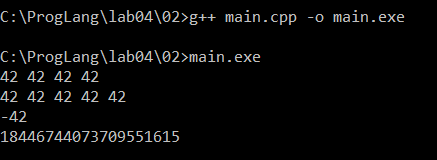
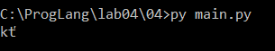
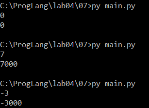
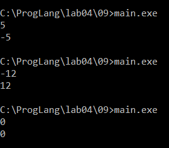

# Языки программирования

## Лабораторная работа № 4. Целочисленные типы и битовые операции

## Задание 1 (3 балла)

> Запишите двоичное представление числа `-99` в целочисленном знаковом типе длиной 1, 2 и 4 байта.
>
> Запишите литералы, равные наибольшему и наименьшему числу в типе `int`, в шестнадцатеричной записи.
>
> Запишите двоичное представление символа `#` в типе `char`.

### Решение

Для получения дополнительного кода числа `-99` сначала запишем число `99` в двоичном виде:

```text
99 = 01100011₂
```

Инвертируем все биты и прибавим единицу:

```text
  01100011
  10011100  — инверсия
+        1
----------
  10011101
```

Следовательно, представление числа `-99` имеет вид:

| Длина типа | Двоичное представление |
|---|---|
| 1 байт | `10011101` |
| 2 байта | `11111111 10011101` |
| 4 байта | `11111111 11111111 11111111 10011101` |

При обычном 32-битном типе `int`:

```cpp
0x7FFFFFFF       // наибольшее значение:  2147483647
-0x7FFFFFFF - 1 // наименьшее значение: -2147483648
```

Битовое представление минимального значения равно `0x80000000`. Сам литерал `0x80000000` в распространённой 32-битной реализации имеет беззнаковый тип, поэтому для получения значения типа `int` безопаснее использовать выражение `-0x7FFFFFFF - 1`.

Код символа `#` в таблице ASCII равен `35`:

```text
35₁₀ = 00100011₂
```

Таким образом, двоичное представление `#` в однобайтовом типе `char`:

```text
00100011
```

---

## Задание 2 (3 балла)

> Напишите пример программы на C++ с использованием целочисленных литералов в разных форматах записи, разной длины, знаковых и беззнаковых. Пример должен охватывать большинство способов записи целочисленных литералов.

### Программа

```cpp
#include <iostream>

int main() {
    int decimal = 42;
    int octal = 052;                  
    int binary = 0b101010;             
    int hexadecimal = 0x2A;           

    unsigned int unsignedValue = 42U;
    long int longValue = 42L;
    unsigned long int unsignedLong = 42UL;
    long long int longLongValue = 42LL;
    unsigned long long int unsignedLongLong = 42ULL;

    long int negativeValue = -42L;
    unsigned long long int largeHex = 0xFFFFFFFFFFFFFFFFULL;

    std::cout << decimal << ' ' << octal << ' '
              << binary << ' ' << hexadecimal << '\n';
    std::cout << unsignedValue << ' ' << longValue << ' '
              << unsignedLong << ' ' << longLongValue << ' '
              << unsignedLongLong << '\n';
    std::cout << negativeValue << '\n';
    std::cout << largeHex << '\n';

    return 0;
}
```

Первые четыре переменные содержат одно значение `42`, записанное в четырёх системах счисления:

- без префикса — десятичная запись;
- префикс `0` — восьмеричная запись;
- префикс `0b` — двоичная запись;
- префикс `0x` — шестнадцатеричная запись.

Суффиксы определяют тип литерала:

- `U` — беззнаковый тип;
- `L` — тип `long`;
- `LL` — тип `long long`;
- комбинации `UL` и `ULL` задают беззнаковые длинные типы.

Знак минус в `-42L` является отдельным унарным оператором, применённым к положительному литералу `42L`.



---

## Задание 3 (2 балла)

> Объясните работу фрагмента программы на C++. В ходе объяснения следует использовать таблицу кодов символов.

```cpp
char a = 'a';
a = a + 10;
std::cout << a;
a = a + 250;
std::cout << a;
```

### Объяснение

В таблице ASCII символу `a` соответствует код `97`:

```text
'a' = 97
97 + 10 = 107
107 = 'k'
```

После первого сложения в переменной `a` находится символ `k`, и программа выводит `k`.

Затем к коду символа `k` прибавляется `250`:

```text
107 + 250 = 357
```

Однобайтовый тип может хранить только `2⁸ = 256` различных битовых комбинаций. В используемой в лекции модели берётся остаток по модулю `256`:

```text
357 mod 256 = 101
101 = 'e'
```

Поэтому в типичной реализации программа выводит:

```text
ke
```

Формально стандарт C++ не требует, чтобы `char` был знаковым или беззнаковым. Преобразование числа `357`, которое не помещается в `char`, зависит от реализации. Вывод `ke` получается в распространённой реализации с сохранением младших восьми битов.


---

## Задание 4 (2 балла)

> Перепишите программу из предыдущего задания на Python, используя функции `chr` и `ord`. Почему её вывод отличается от вывода программы на C++?

### Программа

```python
a = "a"
a = chr(ord(a) + 10)
print(a, end="")

a = chr(ord(a) + 250)
print(a)
```

### Объяснение

Функция `ord` возвращает числовой код символа, а функция `chr` создаёт символ по его коду.

Первое преобразование совпадает с результатом C++:

```text
ord('a') = 97
97 + 10 = 107
chr(107) = 'k'
```

При втором преобразовании Python не ограничивает код одним байтом:

```text
ord('k') = 107
107 + 250 = 357
chr(357) = 'ť'
```

Результат программы:

```text
kť
```

Вывод отличается, потому что строки Python используют Unicode, а `chr(357)` создаёт символ Unicode с кодом `357`. Переполнения по модулю `256` не происходит. Чтобы искусственно повторить типичный результат C++, можно написать:

```python
a = chr((ord(a) + 250) % 256)
```



---

## Задание 5 (2 балла)

> Объясните работу фрагмента программы на C++. В частности, почему `x + x - x = x`, но при этом `(x · 2) / 2 ≠ x`? В отчёте надо привести вычисления, приводящие к ответу.

```cpp
unsigned short x = 40000;
unsigned short y = x + x;
unsigned short z = x * 2;
y = y - x;
z = z / 2;
std::cout << y << " " << z << std::endl;
```

### Объяснение

Предположим, что `unsigned short` занимает 16 бит. Его диапазон:

```text
0 ... 65535
```

При вычислении `x + x` операнды продвигаются до типа `int`:

```text
40000 + 40000 = 80000
```

При присваивании переменной `y` результат приводится к `unsigned short`:

```text
80000 mod 65536 = 14464
```

То же происходит при вычислении `x * 2` и присваивании переменной `z`:

```text
40000 · 2 = 80000
80000 mod 65536 = 14464
```

Теперь вычисляется `y - x`:

```text
14464 - 40000 = -25536
```

После приведения к `unsigned short`:

```text
-25536 mod 65536 = 40000
```

Поэтому значение `y` снова становится равным исходному `x`.

Для `z` выполняется обычное целочисленное деление уже переполненного значения:

```text
14464 / 2 = 7232
```

В результате программа выводит:

```text
40000 7232
```

Равенство `x + x - x = x` восстанавливается благодаря арифметике по модулю `2¹⁶`. В выражении `(x · 2) / 2` деление применяется после потери старшего бита, поэтому восстановить исходное значение уже нельзя.


---

## Задание 6 (2 балла)

> Объясните работу фрагмента программы на C++. Если имеет место переполнение, требуется найти точный ответ до запуска программы, а только потом сверить его с выводом. В отчёте надо привести вычисления, приводящие к ответу.

```cpp
std::cout << 2000000000 + 1000000000 << std::endl;
std::cout << 2000000000U + 1000000000U << std::endl;
std::cout << 2500000000U + 2500000000U << std::endl;
std::cout << 2500000000LL + 2500000000LL << std::endl;
std::cout << 20000U * 200000U << std::endl;
std::cout << 200000U * 200000U << std::endl;
```

### Вычисления

Предположим, что `int` и `unsigned int` занимают 32 бита, а `long long` — 64 бита.

Для 32-битного беззнакового типа модуль равен:

```text
2³² = 4294967296
```

#### 1. Сложение значений типа `int`

```text
2000000000 + 1000000000 = 3000000000
3000000000 - 4294967296 = -1294967296
```

В модели 32-битного дополнительного кода ожидаемый вывод — `-1294967296`. При этом в стандарте C++ переполнение знакового типа является неопределённым поведением, поэтому переносимый точный результат для этого выражения не гарантируется.

#### 2. Сложение беззнаковых значений без переполнения

```text
2000000000U + 1000000000U = 3000000000
```

Значение помещается в `unsigned int`.

#### 3. Сложение беззнаковых значений с переполнением

```text
2500000000U + 2500000000U = 5000000000
5000000000 mod 4294967296 = 705032704
```

#### 4. Сложение значений типа `long long`

```text
2500000000LL + 2500000000LL = 5000000000
```

Значение помещается в 64-битный `long long`.

#### 5. Умножение беззнаковых значений без переполнения

```text
20000U · 200000U = 4000000000
```

Значение помещается в 32-битный `unsigned int`.

#### 6. Умножение беззнаковых значений с переполнением

```text
200000U · 200000U = 40000000000
40000000000 mod 4294967296 = 1345294336
```

Ожидаемые результаты:

| Выражение | Результат |
|---|---:|
| `2000000000 + 1000000000` | обычно `-1294967296`, но по стандарту C++ результат не определён |
| `2000000000U + 1000000000U` | `3000000000` |
| `2500000000U + 2500000000U` | `705032704` |
| `2500000000LL + 2500000000LL` | `5000000000` |
| `20000U * 200000U` | `4000000000` |
| `200000U * 200000U` | `1345294336` |


---

## Задание 7 (2 балла)

> Напишите программу на Python, умножающую введённое число на `1000`. В программе можно использовать только операторы сдвига и сложения. Циклы использовать нельзя. Из функций можно использовать только `input` и `print` для ввода и вывода.

### Решение

Разложим число `1000` в сумму степеней двойки:

```text
1000 = 512 + 256 + 128 + 64 + 32 + 8
     = 2⁹ + 2⁸ + 2⁷ + 2⁶ + 2⁵ + 2³
```

Сдвиг `x << n` равен умножению `x` на `2ⁿ`, поэтому программа имеет вид:

```python
x = int(input())
y = (x << 9) + (x << 8) + (x << 7) + (x << 6) + (x << 5) + (x << 3)
print(y)
```

Например, при `x = 7`:

```text
y = 7 · 1000 = 7000
```



---

## Задание 8 (2 балла)

> Найдите результаты вычисления следующих выражений без использования компьютера или калькулятора. Процесс вычислений должен быть отображён в отчёте.

### 1. `(1000 & 100) << 10`

```text
1000₁₀ = 1111101000₂
 100₁₀ = 0001100100₂
          ----------
          0001100000₂ = 96₁₀
```

После сдвига на 10 разрядов:

```text
96 << 10 = 96 · 1024 = 98304
```

Ответ: `98304`.

### 2. `(1000 >> 4) & 15`

```text
1000 >> 4 = 62
62₁₀ = 111110₂
15₁₀ = 001111₂
        ------
        001110₂ = 14₁₀
```

Ответ: `14`.

### 3. `~1234 + 1234`

Для дополнительного кода справедливо тождество:

```text
~x = -x - 1
```

Следовательно:

```text
~1234 + 1234 = -1234 - 1 + 1234 = -1
```

Ответ: `-1`.

### 4. `(1000 ^ 500) & 63`

Маска `63 = 111111₂` оставляет только шесть младших битов. Поэтому достаточно рассмотреть остатки по модулю `64`:

```text
1000 mod 64 = 40 = 101000₂
 500 mod 64 = 52 = 110100₂
                    ------
40 ^ 52          = 011100₂ = 28₁₀
```

Ответ: `28`.

### 5. `(100 << 3) + (100 >> 3)`

```text
100 << 3 = 100 · 8 = 800
100 >> 3 = 100 div 8 = 12
800 + 12 = 812
```

Ответ: `812`.

---

## Задание 9 (2 балла)

> Напишите программу на языке C++ для умножения заданного целого числа на `-1`. В программе можно использовать только сложение и битовые операции. Условия, циклы и библиотечные функции использовать нельзя.

### Программа

```cpp
#include <iostream>

int main() {
    int x;
    std::cin >> x;

    int result = ~x + 1;
    std::cout << result << std::endl;

    return 0;
}
```

В дополнительном коде выполняется равенство:

```text
-x = ~x + 1
```

Операция `~` инвертирует все биты числа, после чего прибавление единицы формирует его противоположное значение.

Например, для восьмибитного представления числа `5`:

```text
 5 = 00000101
~5 = 11111010
     11111010 + 1 = 11111011 = -5
```

Для минимального значения знакового типа положительное противоположное значение не помещается в тот же тип. Для остальных представимых значений формула даёт результат умножения на `-1`.


